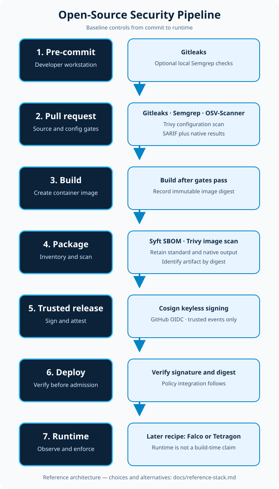

# Awesome Security Pipeline

[](https://awesome.re)
[](http://creativecommons.org/publicdomain/zero/1.0/)
[](https://github.com/rezmoss/awesome-security-pipeline/actions/workflows/security-baseline.yml)

> The practical, continuously verified guide to selecting and implementing open-source security tools at every CI/CD pipeline stage.

**92 metadata-verified repositories · 6 recipe-tested controls · catalog verified July 16, 2026**

Start with a working pipeline, not an empty checklist. The included GitHub Actions baseline runs Gitleaks, Semgrep, OSV-Scanner, Trivy, Syft, and keyless Cosign against a safe demo, retains machine-readable evidence, and [passed end to end in 2m21s](https://github.com/rezmoss/awesome-security-pipeline/actions/runs/29529702096) on GitHub-hosted runners.

**Maintenance promise:** repository status is checked weekly, license and documentation evidence monthly, and the tested recipe after every relevant change and at least monthly. Classification rules and exceptions are public in the [methodology](docs/methodology.md).

[**Run the tested pipeline →**](#10-minute-quick-start) · [Choose controls for your project](#choose-your-baseline) · [Browse tools by pipeline stage](#tool-catalog) · [Read the verification methodology](docs/methodology.md)

[](assets/security-pipeline-architecture.svg)

## Start here

| If you want to… | Start with |
|---|---|
| See a complete working implementation | [10-minute quick start](#10-minute-quick-start) |
| Understand the architecture and measured implementation findings | [Technical implementation article](docs/articles/verified-open-source-security-pipeline.md) |
| Understand every job, artifact, permission, and failure mode | [Security demo guide](examples/security-demo/README.md) |
| Review user-visible release changes and verification evidence | [Changelog](CHANGELOG.md) |
| Choose a smaller or more specialized stack | [Project-type selection matrix](#choose-your-baseline) |
| Compare GitHub Actions security tools and permissions | [Open-source stack comparison](comparisons/github-actions-security-tools.md) |
| Choose an SBOM generator and validation workflow | [SBOM tools comparison](comparisons/sbom-tools.md) |
| Inspect continuously tested SBOM compatibility history | [SBOM benchmark reports](reports/sbom/README.md) |
| Evaluate why these tools were selected | [Reference stack decision](docs/reference-stack.md) |
| Check how projects are selected and classified | [Curation and verification methodology](docs/methodology.md) |

## 10-minute quick start

The fastest safe trial is to run the committed demo in a fork. It requires only a GitHub account and GitHub Actions; it requires no cloud account, custom secret, registry, or deployment.

1. Fork this repository and enable GitHub Actions in the fork.
2. Open **Actions → Security Baseline → Run workflow** and select the default branch.
3. Confirm the Secrets, SAST, Dependencies, IaC, Build, and Package jobs pass.
4. Inspect the named scan reports, CycloneDX SBOM, exported image, and immutable digest under **Artifacts**.
5. To test keyless signing, push the unchanged workflow to the fork's default branch or a `v*` tag. Manual and pull-request runs intentionally skip signing.

To adapt the baseline in another repository, copy these paths first, then change the `examples/security-demo/app` scan and build paths to your application:

```text
.github/workflows/security-baseline.yml
.gitleaks.toml
.semgrep/security-baseline.yml
examples/security-demo/        # replace after the first green run
```

The default policy fails on detected secrets, configured high-confidence SAST findings, any published dependency vulnerability, and fixed HIGH/CRITICAL configuration or image findings. SARIF upload requires GitHub code scanning support; all reports remain downloadable workflow artifacts. See the [demo guide](examples/security-demo/README.md) before changing thresholds or permissions.

## Choose your baseline

Use the smallest set that covers the artifacts you actually ship. “Regulated” below is a starting architecture, not a compliance claim.

| Project type | Start with | Add when applicable | Why |
|---|---|---|---|
| Library | Gitleaks, Semgrep, OSV-Scanner | Syft for release SBOMs; Cosign for signed release files | Protect source and dependencies without container-only stages. |
| Web application | Gitleaks, Semgrep, OSV-Scanner | ZAP against a controlled test deployment | Combine source/dependency gates with explicit dynamic testing. |
| Container service | Tested baseline: Gitleaks, Semgrep, OSV-Scanner, Trivy, Syft, Cosign | Runtime detection such as Falco when operating the service | Cover source, image, SBOM, and signed-package risks. |
| Kubernetes service | Container-service baseline | Trivy manifest scanning, Kyverno or Gatekeeper admission policy, runtime detection | Separate build-time evidence from cluster admission and runtime controls. |
| Regulated project | Relevant baseline above with retained SARIF, SBOM, digest, and signature | Organization-specific policy, approvals, provenance, and evidence retention | Produce reviewable evidence while leaving control mapping to the applicable framework. |

## Contents

- [Start here](#start-here)
- [10-minute quick start](#10-minute-quick-start)
- [Choose your baseline](#choose-your-baseline)
- [Tool catalog](#tool-catalog)
- [Pre-commit & Secrets Detection](#pre-commit--secrets-detection)
- [SBOM Generation](#sbom-generation)
- [Artifact Signing & Verification](#artifact-signing--verification)
- [Supply Chain Compliance](#supply-chain-compliance)
- [Software Composition Analysis (SCA)](#software-composition-analysis-sca)
- [Static Application Security Testing (SAST)](#static-application-security-testing-sast)
  - [Multi-language](#multi-language)
  - [Language-specific](#language-specific)
- [Infrastructure as Code Security](#infrastructure-as-code-security)
- [Container Security](#container-security)
  - [Image Scanning](#image-scanning)
  - [Runtime Security](#runtime-security)
- [Kubernetes Security](#kubernetes-security)
- [Policy as Code](#policy-as-code)
- [Secret Management](#secret-management)
- [API & Dynamic Testing (DAST)](#api--dynamic-testing-dast)
- [Cloud Security](#cloud-security)
- [Legacy and Reference Tools](#legacy-and-reference-tools)
- [Reading the Badges](#reading-the-badges)
- [Contributing](#contributing)
- [License](#license)

---

## Tool catalog

Entries below are organized by where they operate in a delivery pipeline. Status reflects repository activity, not security effectiveness; stars indicate adoption, not quality. Multi-purpose tools may appear in more than one category with a category-specific description.

## Pre-commit & Secrets Detection

Catch secrets and credentials before they enter your repository.

- [detect-secrets](https://github.com/Yelp/detect-secrets) - Prevent secrets from entering codebases.   
- [git-secrets](https://github.com/awslabs/git-secrets) - Prevent committing AWS credentials and secrets.   
- [gitleaks](https://github.com/gitleaks/gitleaks) - Detect and prevent secrets in git repos.   
- [pre-commit](https://github.com/pre-commit/pre-commit) - Manage multi-language pre-commit hooks.   
- [talisman](https://github.com/thoughtworks/talisman) - Detect secrets with pre-push and pre-commit hooks.   
- [trufflehog](https://github.com/trufflesecurity/trufflehog) - Find credentials in git history and live systems.   

## SBOM Generation

Generate Software Bill of Materials for supply chain visibility.

- [cdxgen](https://github.com/CycloneDX/cdxgen) - Create CycloneDX SBOMs for various languages.   
- [cyclonedx-cli](https://github.com/CycloneDX/cyclonedx-cli) - Inspect, convert, and merge CycloneDX SBOMs.   
- [sbom-tool](https://github.com/microsoft/sbom-tool) - Generate SBOMs for build artifacts and source repositories.   
- [sbomlyze](https://github.com/rezmoss/sbomlyze) - Compare SBOMs to detect supply-chain drift.   
- [syft](https://github.com/anchore/syft) - Generate SBOMs from container images and filesystems.   

## Artifact Signing & Verification

Sign and verify container images and artifacts for supply chain security.

- [cosign](https://github.com/sigstore/cosign) - Sign and verify container images.   
- [notation](https://github.com/notaryproject/notation) - Sign and verify OCI artifacts with Notary Project specifications.   
- [rekor](https://github.com/sigstore/rekor) - Record signed artifacts in a tamper-resistant transparency log.   

## Supply Chain Compliance

Audit and verify supply chain security against industry benchmarks.

- [in-toto](https://github.com/in-toto/in-toto) - Protect software supply-chain integrity with signed metadata.   
- [scorecard](https://github.com/ossf/scorecard) - Measure open-source project security practices with OpenSSF checks.   
- [slsa-verifier](https://github.com/slsa-framework/slsa-verifier) - Verify SLSA provenance for supply chain security.   

## Software Composition Analysis (SCA)

Scan dependencies for known vulnerabilities.

- [bomber](https://github.com/devops-kung-fu/bomber) - Scan SBOMs for vulnerabilities.   
- [dependency-track](https://github.com/DependencyTrack/dependency-track) - Track components and analyze dependency risk from SBOMs.   
- [grype](https://github.com/anchore/grype) - Scan filesystems and SBOMs for dependency vulnerabilities.   
- [osv-scanner](https://github.com/google/osv-scanner) - Scan dependencies for vulnerabilities in the OSV database.   
- [safe-chain](https://github.com/AikidoSec/safe-chain) - Block malicious packages during npm/pip install.   
- [snyk-cli](https://github.com/snyk/cli) - Find and fix vulnerabilities in dependencies.   
- [trivy](https://github.com/aquasecurity/trivy) - Scan operating-system and language dependencies for vulnerabilities.   
- [vet](https://github.com/safedep/vet) - Enforce dependency policies and report supply-chain risks.   

## Static Application Security Testing (SAST)

Analyze source code for security vulnerabilities.

### Multi-language

Tools that support multiple programming languages.

- [bearer](https://github.com/Bearer/bearer) - Trace sensitive data flows and detect security risks in code.   
- [codeql](https://github.com/github/codeql) - Analyze code semantically with GitHub's query engine.   
- [semgrep](https://github.com/semgrep/semgrep) - Scan source code with multi-language static-analysis rules.   
- [sonarqube](https://github.com/SonarSource/sonarqube) - Inspect code continuously for quality and security issues.   
- [spotbugs](https://github.com/spotbugs/spotbugs) - Find bug patterns in Java bytecode.   

### Language-specific

Specialized tools for individual programming languages.

#### Python

- [bandit](https://github.com/PyCQA/bandit) - Find common security issues in Python code.   
- [safety](https://github.com/pyupio/safety) - Check Python dependencies for vulnerabilities.   

#### JavaScript/Node.js

- [eslint-plugin-security](https://github.com/eslint-community/eslint-plugin-security) - Detect security patterns in Node.js with ESLint rules.   

#### Go

- [gosec](https://github.com/securego/gosec) - Find security issues in Go source code.   
- [govulncheck](https://github.com/golang/vuln) - Report reachable Go vulnerabilities in source and binaries.   

#### Ruby

- [brakeman](https://github.com/presidentbeef/brakeman) - Scan Ruby on Rails applications with static analysis.   

#### PHP

- [phpstan](https://github.com/phpstan/phpstan) - Analyze PHP code without running it.   
- [psalm](https://github.com/vimeo/psalm) - Analyze PHP code for type and security issues.   

#### Rust

- [cargo-audit](https://github.com/RustSec/rustsec) - Audit Cargo.lock for crates with security vulnerabilities.   

## Infrastructure as Code Security

Scan infrastructure configurations for security misconfigurations.

- [cfn-lint](https://github.com/aws-cloudformation/cfn-lint) - Lint AWS CloudFormation templates with security rules.   
- [checkov](https://github.com/bridgecrewio/checkov) - Scan cloud infrastructure configurations.   
- [kics](https://github.com/Checkmarx/kics) - Find security vulnerabilities and compliance issues in IaC.   
- [snyk-iac](https://github.com/snyk/cli) - Scan infrastructure as code for security issues.   
- [trivy](https://github.com/aquasecurity/trivy) - Scan Terraform, CloudFormation, and other IaC for misconfigurations.   
- [zizmor](https://github.com/zizmorcore/zizmor) - Analyze GitHub Actions workflows for security issues.   

## Container Security

Secure container images and runtime environments.

### Image Scanning

Scan container images for vulnerabilities before deployment.

- [clair](https://github.com/quay/clair) - Analyze container images for known vulnerabilities.   
- [docker-bench-security](https://github.com/docker/docker-bench-security) - Check Docker deployment against CIS benchmarks.   
- [dockle](https://github.com/goodwithtech/dockle) - Lint container images for security best practices.   
- [grype](https://github.com/anchore/grype) - Scan container images for operating-system and library vulnerabilities.   
- [hadolint](https://github.com/hadolint/hadolint) - Lint Dockerfiles for security and build best practices.   
- [trivy](https://github.com/aquasecurity/trivy) - Scan container images for operating-system and library vulnerabilities.   

### Runtime Security

Monitor and protect containers at runtime.

- [falco](https://github.com/falcosecurity/falco) - Detect runtime threats in cloud-native environments.   
- [tetragon](https://github.com/cilium/tetragon) - Observe and enforce runtime security with eBPF.   
- [tracee](https://github.com/aquasecurity/tracee) - Trace Linux runtime activity and security events with eBPF.   

## Kubernetes Security

Secure Kubernetes clusters, manifests, and workloads.

- [kube-bench](https://github.com/aquasecurity/kube-bench) - Check Kubernetes against CIS benchmarks.   
- [kube-linter](https://github.com/stackrox/kube-linter) - Analyze Kubernetes YAML and Helm charts before deployment.   
- [kubescape](https://github.com/kubescape/kubescape) - Analyze Kubernetes security risk and configuration compliance.   
- [KubeStellar Console](https://github.com/kubestellar/console) - View security signals across multiple Kubernetes clusters.   
- [kyverno](https://github.com/kyverno/kyverno) - Enforce policies with Kubernetes-native resources.   
- [polaris](https://github.com/FairwindsOps/polaris) - Validate Kubernetes best practices and policies.   
- [trivy-operator](https://github.com/aquasecurity/trivy-operator) - Generate Kubernetes-native security reports.   

## Policy as Code

Define and enforce security policies as code across your infrastructure.

- [conftest](https://github.com/open-policy-agent/conftest) - Test configuration files against OPA policies.   
- [gatekeeper](https://github.com/open-policy-agent/gatekeeper) - Enforce OPA policies through Kubernetes admission control.   
- [opa](https://github.com/open-policy-agent/opa) - Evaluate policy as code across application and infrastructure systems.   

## Secret Management

Securely manage and distribute secrets in Kubernetes and GitOps workflows.

- [external-secrets](https://github.com/external-secrets/external-secrets) - Sync secrets from AWS/Vault/Azure into Kubernetes.   
- [infisical](https://github.com/Infisical/infisical) - Manage application secrets with automation integrations.   
- [sealed-secrets](https://github.com/bitnami-labs/sealed-secrets) - Encrypt secrets locally, decrypt only in cluster.   
- [sops](https://github.com/getsops/sops) - Encrypt structured files while preserving editor workflows.   
- [vault](https://github.com/hashicorp/vault) - Manage secrets, encryption, and privileged access.   

## API & Dynamic Testing (DAST)

Test running applications for vulnerabilities.

- [nikto](https://github.com/sullo/nikto) - Scan web servers for dangerous files and known vulnerabilities.   
- [nuclei](https://github.com/projectdiscovery/nuclei) - Scan applications and infrastructure with customizable templates.   
- [sqlmap](https://github.com/sqlmapproject/sqlmap) - Detect and validate SQL injection vulnerabilities.   
- [wapiti](https://github.com/wapiti-scanner/wapiti) - Scan web applications for vulnerabilities with black-box testing.   
- [zap](https://github.com/zaproxy/zaproxy) - Scan web applications dynamically with OWASP ZAP.   

## Cloud Security

Assess and audit cloud infrastructure security posture.

- [cartography](https://github.com/lyft/cartography) - Map infrastructure relationships and attack surface.   
- [cloudquery](https://github.com/cloudquery/cloudquery) - Inventory cloud assets and analyze them with SQL.   
- [cloudsplaining](https://github.com/salesforce/cloudsplaining) - Assess AWS IAM policies for risky permissions.   
- [prowler](https://github.com/prowler-cloud/prowler) - Assess AWS, Azure, and GCP security configurations.   
- [steampipe](https://github.com/turbot/steampipe) - Query cloud resources using SQL.   

## Legacy and Reference Tools

These projects are retained for migration research and historical context, not recommended for new adoption. They are separated from the active catalog because their repositories are archived or exceed the project's unmaintained threshold. Prefer the maintained alternatives noted beside an entry or select one from the active category above.

### Pre-commit & Secrets Detection

- [whispers](https://github.com/Skyscanner/whispers) - Identify hardcoded secrets in static code analysis.   

### SBOM Generation

- [spdx-sbom-generator](https://github.com/opensbom-generator/spdx-sbom-generator) - Generate SPDX format SBOMs from source code.   
- [tern](https://github.com/tern-tools/tern) - Analyze container images for software composition.   

### Supply Chain Compliance

- [chain-bench](https://github.com/aquasecurity/chain-bench) - Audit supply chain against CIS benchmarks.   

### Static Application Security Testing (SAST) › Multi-language

- [horusec](https://github.com/ZupIT/horusec) - Analyze source code across multiple languages.   

### Static Application Security Testing (SAST) › Language-specific › Python

- [pyre-check](https://github.com/facebook/pyre-check) - Analyze Python types and selected security properties.   

### Static Application Security Testing (SAST) › Language-specific › JavaScript/Node.js

- [njsscan](https://github.com/ajinabraham/njsscan) - Analyze Node.js applications with semantic SAST rules.   

### Infrastructure as Code Security

- [terrascan](https://github.com/tenable/terrascan) - Detect compliance and security violations in IaC.   
- [tfsec](https://github.com/aquasecurity/tfsec) - Scan Terraform code for security issues.   

### Container Security › Image Scanning

- [anchore-engine](https://github.com/anchore/anchore-engine) - Analyze containers and evaluate image policies.    *(Migrate to [Syft](https://github.com/anchore/syft) + [Grype](https://github.com/anchore/grype))*
- [dive](https://github.com/wagoodman/dive) - Inspect image layers and contents; it does not scan vulnerability databases.   

### Container Security › Runtime Security

- [sysdig-inspect](https://github.com/draios/sysdig-inspect) - Visualize system calls and analyze containers.   

### Kubernetes Security

- [kube-hunter](https://github.com/aquasecurity/kube-hunter) - Hunt for security weaknesses in Kubernetes clusters.   
- [kubiscan](https://github.com/cyberark/KubiScan) - Scan Kubernetes RBAC for risky permissions.   

### Policy as Code

- [datree](https://github.com/datreeio/datree) - Prevent Kubernetes misconfigurations.   

### API & Dynamic Testing (DAST)

- [arachni](https://github.com/Arachni/arachni) - Scan web applications for security issues.    *(Consider [ZAP](https://github.com/zaproxy/zaproxy) or [Nuclei](https://github.com/projectdiscovery/nuclei) instead)*

### Cloud Security

- [ScoutSuite](https://github.com/nccgroup/ScoutSuite) - Audit security configurations across multiple cloud providers.   

---

## Reading the Badges

Each tool displays status and activity badges for transparency.

### Maintenance Status (Updated Weekly)

Status badges are **automatically updated every week** by our GitHub Action to reflect current maintenance status.

| Badge | Meaning |
|-------|---------|
|  | **Active** - Updated within the last 6 months |
|  | **Stale** - No updates in 6-12 months; use with caution |
|  | **Unmaintained** - No updates in 12+ months; consider alternatives |
|  | **Archived** - Repository has been archived by owner |
|  | **Deprecated** - Officially superseded; migration recommended |

### Activity Badges

| Badge | Meaning |
|-------|---------|
|  | GitHub star count - indicates community adoption |
|  | Last commit date - shows exact update time |

> **Tip:** While we update status badges weekly, always verify the "Last Commit" badge for the most current information before adopting a tool.

## Contributing

Contributions are welcome! Please read the [contribution guidelines](CONTRIBUTING.md) first.

**Before submitting:**
- Repository must be **at least 1 month old** (anti-spam requirement)
- Repository must have **at least 5 stars**
- Tool must have been **updated within the last 12 months**
- You must **disclose any affiliation** with the tool

See [CONTRIBUTING.md](CONTRIBUTING.md) for full details.

## License

[](http://creativecommons.org/publicdomain/zero/1.0/)

To the extent possible under law, the contributors have waived all copyright and related or neighboring rights to this work.
